# 📋 Análisis de Casos de Uso - Sistema PAE Cauca

## 📊 Información del Proyecto

**Nombre del Proyecto**: Sistema de Gestión de Visitas PAE - Sedes Educativas del Cauca  
**Fecha de Análisis**: Diciembre 2024  
**Versión del Documento**: 1.0  
**Responsable**: Equipo de Desarrollo PAE Cauca  

## 🎯 Objetivo

Definir y documentar los casos de uso principales del Sistema PAE Cauca, describiendo las interacciones entre los actores y el sistema para cumplir con los objetivos del negocio.

## 👥 Actores del Sistema

### **Actores Primarios**
- **Visitador PAE**: Profesional que realiza las visitas a las sedes educativas
- **Supervisor PAE**: Responsable de asignar visitas y supervisar el trabajo de los visitadores
- **Administrador del Sistema**: Gestor del sistema y usuarios

### **Actores Secundarios**
- **Sistema de Notificaciones**: Envía notificaciones push y por email
- **Sistema de Sincronización**: Gestiona la sincronización offline/online
- **Sistema de Reportes**: Genera reportes y exportaciones

### **Actores Externos**
- **Secretaría de Educación**: Entidad que supervisa el programa PAE
- **Rector/Director**: Personal directivo de las instituciones educativas

## 📋 Casos de Uso por Módulo

### **Módulo 1: Autenticación y Gestión de Usuarios**

#### **CU-001: Iniciar Sesión**
- **Actor Primario**: Visitador PAE, Supervisor PAE, Administrador
- **Actor Secundario**: Sistema de Autenticación
- **Descripción**: El usuario inicia sesión en el sistema con sus credenciales
- **Precondiciones**: El usuario debe estar registrado en el sistema
- **Flujo Principal**:
  1. El usuario abre la aplicación
  2. El sistema muestra la pantalla de login
  3. El usuario ingresa email y contraseña
  4. El sistema valida las credenciales
  5. El sistema genera tokens JWT
  6. El sistema redirige al dashboard correspondiente
- **Flujo Alternativo 4a**: Credenciales inválidas
  4a. El sistema muestra mensaje de error
  4b. El usuario puede reintentar o recuperar contraseña
- **Postcondiciones**: El usuario está autenticado y puede acceder al sistema
- **Criterios de Aceptación**:
  - Validación de credenciales
  - Generación de tokens seguros
  - Redirección según rol de usuario
  - Manejo de errores de autenticación

#### **CU-002: Recuperar Contraseña**
- **Actor Primario**: Usuario del sistema
- **Actor Secundario**: Sistema de Email
- **Descripción**: El usuario recupera su contraseña olvidada mediante código de verificación
- **Precondiciones**: El usuario debe tener una cuenta registrada
- **Flujo Principal**:
  1. El usuario selecciona "Olvidé mi contraseña"
  2. El usuario ingresa su email
  3. El sistema valida que el email existe
  4. El sistema genera código de 6 dígitos
  5. El sistema envía código por email
  6. El usuario ingresa el código recibido
  7. El sistema valida el código
  8. El usuario ingresa nueva contraseña
  9. El sistema actualiza la contraseña
  10. El sistema envía confirmación por email
- **Flujo Alternativo 3a**: Email no existe
  3a. El sistema muestra mensaje de error
  3b. El usuario puede verificar el email o registrarse
- **Flujo Alternativo 7a**: Código inválido o expirado
  7a. El sistema muestra mensaje de error
  7b. El usuario puede solicitar nuevo código
- **Postcondiciones**: El usuario puede iniciar sesión con nueva contraseña
- **Criterios de Aceptación**:
  - Validación de email existente
  - Generación de código seguro
  - Envío de email con código
  - Validación de código con expiración
  - Actualización segura de contraseña

#### **CU-003: Gestionar Perfil de Usuario**
- **Actor Primario**: Usuario autenticado
- **Actor Secundario**: Sistema de Gestión de Usuarios
- **Descripción**: El usuario actualiza su información personal
- **Precondiciones**: El usuario debe estar autenticado
- **Flujo Principal**:
  1. El usuario accede a su perfil
  2. El usuario modifica la información deseada
  3. El sistema valida los datos ingresados
  4. El usuario confirma los cambios
  5. El sistema actualiza la información
  6. El sistema muestra confirmación
- **Flujo Alternativo 3a**: Datos inválidos
  3a. El sistema muestra errores de validación
  3b. El usuario corrige los errores
- **Postcondiciones**: La información del usuario está actualizada
- **Criterios de Aceptación**:
  - Validación de datos de entrada
  - Actualización segura de información
  - Confirmación de cambios
  - Manejo de errores de validación

### **Módulo 2: Gestión de Visitas PAE**

#### **CU-004: Crear Cronograma de Visita**
- **Actor Primario**: Visitador PAE
- **Actor Secundario**: Sistema de Validación, Sistema de Sincronización
- **Descripción**: El visitador crea un cronograma de visita PAE
- **Precondiciones**: El visitador debe estar autenticado
- **Flujo Principal**:
  1. El visitador selecciona "Crear Cronograma"
  2. El sistema muestra formulario de cronograma
  3. El visitador selecciona municipio
  4. El sistema carga instituciones del municipio
  5. El visitador selecciona institución
  6. El sistema carga sedes de la institución
  7. El visitador selecciona sede
  8. El visitador configura contrato y operador
  9. El visitador programa fecha y hora
  10. El visitador selecciona caso de atención prioritaria
  11. El visitador agrega observaciones
  12. El visitador confirma el cronograma
  13. El sistema valida los datos
  14. El sistema guarda el cronograma
  15. El sistema sincroniza con el servidor
- **Flujo Alternativo 13a**: Datos inválidos
  13a. El sistema muestra errores de validación
  13b. El visitador corrige los errores
- **Flujo Alternativo 15a**: Sin conexión
  15a. El sistema guarda localmente
  15b. El sistema sincroniza cuando haya conexión
- **Postcondiciones**: El cronograma está creado y sincronizado
- **Criterios de Aceptación**:
  - Validación de datos requeridos
  - Carga dinámica de opciones
  - Guardado local y sincronización
  - Manejo de errores de validación

#### **CU-005: Completar Visita PAE**
- **Actor Primario**: Visitador PAE
- **Actor Secundario**: Sistema de Checklist, Sistema de Evidencias
- **Descripción**: El visitador completa una visita PAE con checklist y evidencias
- **Precondiciones**: El visitador debe tener una visita asignada
- **Flujo Principal**:
  1. El visitador selecciona visita pendiente
  2. El sistema muestra formulario de visita
  3. El visitador completa información básica
  4. El visitador responde checklist por categorías
  5. El visitador captura evidencias (fotos, audio, firma)
  6. El visitador registra coordenadas GPS
  7. El visitador agrega observaciones
  8. El visitador confirma la visita
  9. El sistema valida los datos
  10. El sistema guarda la visita
  11. El sistema sincroniza con el servidor
- **Flujo Alternativo 9a**: Datos incompletos
  9a. El sistema muestra items faltantes
  9b. El visitador completa los datos faltantes
- **Flujo Alternativo 11a**: Sin conexión
  11a. El sistema guarda localmente
  11b. El sistema sincroniza cuando haya conexión
- **Postcondiciones**: La visita está completada y sincronizada
- **Criterios de Aceptación**:
  - Validación de checklist completo
  - Captura de evidencias multimedia
  - Registro de ubicación GPS
  - Guardado local y sincronización

#### **CU-006: Asignar Visita**
- **Actor Primario**: Supervisor PAE
- **Actor Secundario**: Sistema de Notificaciones
- **Descripción**: El supervisor asigna una visita a un visitador
- **Precondiciones**: El supervisor debe estar autenticado
- **Flujo Principal**:
  1. El supervisor selecciona "Asignar Visita"
  2. El sistema muestra formulario de asignación
  3. El supervisor selecciona visitador
  4. El supervisor selecciona sede
  5. El supervisor programa fecha y hora
  6. El supervisor asigna prioridad
  7. El supervisor agrega observaciones
  8. El supervisor confirma la asignación
  9. El sistema valida los datos
  10. El sistema guarda la asignación
  11. El sistema notifica al visitador
- **Flujo Alternativo 9a**: Datos inválidos
  9a. El sistema muestra errores de validación
  9b. El supervisor corrige los errores
- **Postcondiciones**: La visita está asignada y el visitador notificado
- **Criterios de Aceptación**:
  - Validación de datos de asignación
  - Notificación automática al visitador
  - Guardado de asignación
  - Manejo de errores de validación

### **Módulo 3: Sistema de Evidencias**

#### **CU-007: Capturar Evidencia Fotográfica**
- **Actor Primario**: Visitador PAE
- **Actor Secundario**: Sistema de Cámara, Sistema de Almacenamiento
- **Descripción**: El visitador captura fotos como evidencia de la visita
- **Precondiciones**: El visitador debe estar en una visita activa
- **Flujo Principal**:
  1. El visitador selecciona "Capturar Foto"
  2. El sistema abre la cámara
  3. El visitador toma la foto
  4. El sistema muestra preview de la foto
  5. El visitador confirma o descarta la foto
  6. El sistema comprime la imagen
  7. El sistema asocia la foto con el item del checklist
  8. El sistema guarda la foto localmente
- **Flujo Alternativo 5a**: Foto descartada
  5a. El visitador puede tomar otra foto
- **Flujo Alternativo 6a**: Error de compresión
  6a. El sistema muestra mensaje de error
  6b. El visitador puede reintentar
- **Postcondiciones**: La foto está capturada y asociada a la visita
- **Criterios de Aceptación**:
  - Captura de foto de calidad
  - Compresión automática de imagen
  - Asociación con item del checklist
  - Almacenamiento local seguro

#### **CU-008: Grabar Audio**
- **Actor Primario**: Visitador PAE
- **Actor Secundario**: Sistema de Micrófono, Sistema de Almacenamiento
- **Descripción**: El visitador graba audio como evidencia de la visita
- **Precondiciones**: El visitador debe estar en una visita activa
- **Flujo Principal**:
  1. El visitador selecciona "Grabar Audio"
  2. El sistema solicita permisos de micrófono
  3. El visitador inicia la grabación
  4. El sistema muestra indicador de grabación
  5. El visitador detiene la grabación
  6. El sistema reproduce el audio
  7. El visitador confirma o descarta el audio
  8. El sistema comprime el archivo de audio
  9. El sistema asocia el audio con la observación
  10. El sistema guarda el audio localmente
- **Flujo Alternativo 7a**: Audio descartado
  7a. El visitador puede grabar nuevamente
- **Postcondiciones**: El audio está grabado y asociado a la visita
- **Criterios de Aceptación**:
  - Grabación de audio de calidad
  - Compresión automática de archivo
  - Asociación con observación
  - Almacenamiento local seguro

#### **CU-009: Capturar Firma Digital**
- **Actor Primario**: Visitador PAE
- **Actor Secundario**: Sistema de Pantalla Táctil, Sistema de Almacenamiento
- **Descripción**: El visitador captura la firma del responsable de la sede
- **Precondiciones**: El visitador debe estar en una visita activa
- **Flujo Principal**:
  1. El visitador selecciona "Capturar Firma"
  2. El sistema muestra pantalla de firma
  3. El responsable firma en la pantalla
  4. El sistema valida que la firma no esté vacía
  5. El visitador confirma la firma
  6. El sistema convierte la firma a imagen
  7. El sistema asocia la firma con la visita
  8. El sistema guarda la firma localmente
- **Flujo Alternativo 4a**: Firma vacía
  4a. El sistema solicita firmar nuevamente
- **Postcondiciones**: La firma está capturada y asociada a la visita
- **Criterios de Aceptación**:
  - Captura de firma en pantalla táctil
  - Validación de firma no vacía
  - Conversión a imagen
  - Almacenamiento local seguro

### **Módulo 4: Sincronización Offline/Online**

#### **CU-010: Sincronizar Datos**
- **Actor Primario**: Sistema de Sincronización
- **Actor Secundario**: Servidor Backend, Base de Datos Local
- **Descripción**: El sistema sincroniza datos entre el dispositivo local y el servidor
- **Precondiciones**: El sistema debe detectar conexión a internet
- **Flujo Principal**:
  1. El sistema detecta conexión a internet
  2. El sistema identifica datos pendientes de sincronización
  3. El sistema valida los datos localmente
  4. El sistema envía datos al servidor
  5. El servidor valida los datos
  6. El servidor procesa los datos
  7. El servidor responde con confirmación
  8. El sistema actualiza el estado local
  9. El sistema marca datos como sincronizados
- **Flujo Alternativo 5a**: Datos inválidos en servidor
  5a. El servidor responde con errores
  5b. El sistema maneja los errores
  5c. El sistema reintenta sincronización
- **Flujo Alternativo 7a**: Error de comunicación
  7a. El sistema guarda datos para reintento
  7b. El sistema reintenta en siguiente oportunidad
- **Postcondiciones**: Los datos están sincronizados entre local y servidor
- **Criterios de Aceptación**:
  - Detección automática de conexión
  - Validación de datos antes de envío
  - Manejo de errores de sincronización
  - Actualización de estado local

### **Módulo 5: Sistema de Notificaciones**

#### **CU-011: Enviar Notificación de Visita Próxima**
- **Actor Primario**: Sistema de Notificaciones
- **Actor Secundario**: Visitador PAE
- **Descripción**: El sistema notifica al visitador sobre una visita próxima
- **Precondiciones**: Debe existir una visita programada para las próximas 24 horas
- **Flujo Principal**:
  1. El sistema identifica visitas próximas
  2. El sistema genera notificación
  3. El sistema envía notificación push
  4. El sistema envía notificación local
  5. El visitador recibe la notificación
  6. El visitador puede abrir la aplicación
- **Flujo Alternativo 3a**: Error en envío push
  3a. El sistema registra el error
  3b. El sistema reintenta el envío
- **Postcondiciones**: El visitador está notificado sobre la visita próxima
- **Criterios de Aceptación**:
  - Identificación automática de visitas próximas
  - Envío de notificaciones push y locales
  - Manejo de errores de envío
  - Registro de notificaciones enviadas

### **Módulo 6: Dashboard y Reportes**

#### **CU-012: Generar Reporte de Visitas**
- **Actor Primario**: Supervisor PAE, Administrador
- **Actor Secundario**: Sistema de Reportes
- **Descripción**: El usuario genera un reporte de visitas con filtros específicos
- **Precondiciones**: El usuario debe estar autenticado
- **Flujo Principal**:
  1. El usuario accede al módulo de reportes
  2. El usuario selecciona tipo de reporte
  3. El usuario aplica filtros (fecha, municipio, estado)
  4. El usuario selecciona formato (Excel, PDF)
  5. El usuario confirma la generación
  6. El sistema procesa la solicitud
  7. El sistema genera el reporte
  8. El sistema descarga el archivo
- **Flujo Alternativo 7a**: Error en generación
  7a. El sistema muestra mensaje de error
  7b. El usuario puede reintentar
- **Postcondiciones**: El reporte está generado y descargado
- **Criterios de Aceptación**:
  - Aplicación de filtros de reporte
  - Generación en múltiples formatos
  - Manejo de errores de generación
  - Descarga exitosa del archivo

## 📊 Diagrama de Casos de Uso

```mermaid
graph TB
    subgraph "Actores Externos"
        SE[Secretaría de Educación]
        RD[Rector/Director]
    end
    
    subgraph "Actores Primarios"
        V[Visitador PAE]
        S[Supervisor PAE]
        A[Administrador]
    end
    
    subgraph "Sistema PAE Cauca"
        subgraph "Módulo Autenticación"
            CU001[Iniciar Sesión]
            CU002[Recuperar Contraseña]
            CU003[Gestionar Perfil]
        end
        
        subgraph "Módulo Visitas"
            CU004[Crear Cronograma]
            CU005[Completar Visita]
            CU006[Asignar Visita]
        end
        
        subgraph "Módulo Evidencias"
            CU007[Capturar Foto]
            CU008[Grabar Audio]
            CU009[Capturar Firma]
        end
        
        subgraph "Módulo Sincronización"
            CU010[Sincronizar Datos]
        end
        
        subgraph "Módulo Notificaciones"
            CU011[Enviar Notificación]
        end
        
        subgraph "Módulo Reportes"
            CU012[Generar Reporte]
        end
    end
    
    %% Relaciones Visitador
    V --> CU001
    V --> CU002
    V --> CU003
    V --> CU004
    V --> CU005
    V --> CU007
    V --> CU008
    V --> CU009
    V --> CU010
    V --> CU011
    
    %% Relaciones Supervisor
    S --> CU001
    S --> CU002
    S --> CU003
    S --> CU006
    S --> CU010
    S --> CU011
    S --> CU012
    
    %% Relaciones Administrador
    A --> CU001
    A --> CU002
    A --> CU003
    A --> CU010
    A --> CU011
    A --> CU012
    
    %% Relaciones Externas
    SE --> CU012
    RD --> CU011
```

## 📈 Priorización de Casos de Uso

### **Alta Prioridad (Críticos)**
- CU-001: Iniciar Sesión
- CU-004: Crear Cronograma de Visita
- CU-005: Completar Visita PAE
- CU-006: Asignar Visita
- CU-010: Sincronizar Datos

### **Media Prioridad (Importantes)**
- CU-002: Recuperar Contraseña
- CU-007: Capturar Evidencia Fotográfica
- CU-009: Capturar Firma Digital
- CU-011: Enviar Notificación de Visita Próxima
- CU-012: Generar Reporte de Visitas

### **Baja Prioridad (Deseables)**
- CU-003: Gestionar Perfil de Usuario
- CU-008: Grabar Audio

## ✅ Criterios de Aceptación Generales

### **Funcionalidad**
- Todos los casos de uso deben cumplir con los flujos principales definidos
- Los flujos alternativos deben manejar errores de manera apropiada
- Las precondiciones y postcondiciones deben ser validadas
- Los criterios de aceptación específicos deben cumplirse

### **Usabilidad**
- Los casos de uso deben ser intuitivos para los usuarios
- Los mensajes de error deben ser claros y útiles
- La navegación debe ser consistente
- Los tiempos de respuesta deben ser aceptables

### **Seguridad**
- Todos los casos de uso deben validar la autenticación
- Los datos sensibles deben ser protegidos
- Las transacciones deben ser seguras
- Los logs deben registrar las acciones importantes

---

Esta documentación de casos de uso proporciona una base sólida para el desarrollo del Sistema PAE Cauca, asegurando que todas las funcionalidades críticas sean implementadas de manera consistente y eficiente.
