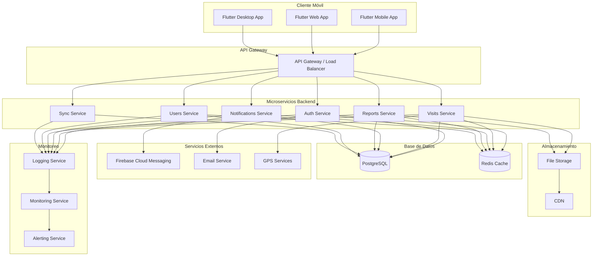

# 🏗️ Análisis Técnico y Arquitectura - Sistema PAE Cauca

## 📊 Información del Proyecto

**Nombre del Proyecto**: Sistema de Gestión de Visitas PAE - Sedes Educativas del Cauca  
**Fecha de Análisis**: Diciembre 2024  
**Versión del Documento**: 1.0  
**Responsable**: Equipo de Desarrollo PAE Cauca  

## 🎯 Objetivo

Definir la arquitectura técnica del Sistema PAE Cauca, incluyendo decisiones de diseño, patrones arquitectónicos, tecnologías seleccionadas y justificaciones técnicas que garanticen la escalabilidad, mantenibilidad y performance del sistema.

## 🏛️ Arquitectura General del Sistema

### **Patrón Arquitectónico: Microservicios Distribuidos**

El Sistema PAE Cauca implementa una arquitectura de microservicios distribuidos con los siguientes principios:

- **Separación de Responsabilidades**: Cada servicio tiene una responsabilidad específica
- **Independencia de Despliegue**: Los servicios pueden desplegarse independientemente
- **Escalabilidad Horizontal**: Cada servicio puede escalarse según demanda
- **Tolerancia a Fallos**: El sistema continúa funcionando ante fallos parciales
- **Offline-First**: Funcionamiento completo sin conexión a internet

### **Diagrama de Arquitectura de Alto Nivel**



## 🔧 Arquitectura del Frontend (Flutter)

### **Patrón Arquitectónico: Clean Architecture + MVVM**

#### **Estructura de Capas**

```
lib/
├── presentation/          # Capa de Presentación
│   ├── screens/          # Pantallas de la aplicación
│   ├── widgets/          # Widgets reutilizables
│   └── providers/        # Gestión de estado (Provider)
├── domain/               # Capa de Dominio
│   ├── entities/         # Entidades de negocio
│   ├── repositories/     # Interfaces de repositorios
│   └── usecases/         # Casos de uso
├── data/                 # Capa de Datos
│   ├── models/           # Modelos de datos
│   ├── repositories/     # Implementación de repositorios
│   ├── datasources/      # Fuentes de datos
│   └── services/         # Servicios de API
└── core/                 # Capa Core
    ├── constants/        # Constantes
    ├── utils/            # Utilidades
    └── errors/           # Manejo de errores
```

#### **Patrones de Diseño Implementados**

**1. Repository Pattern**
```dart
abstract class VisitaRepository {
  Future<List<Visita>> getVisitas();
  Future<Visita> createVisita(Visita visita);
  Future<void> syncVisitas();
}

class VisitaRepositoryImpl implements VisitaRepository {
  final VisitaLocalDataSource localDataSource;
  final VisitaRemoteDataSource remoteDataSource;
  final NetworkInfo networkInfo;
  
  @override
  Future<List<Visita>> getVisitas() async {
    if (await networkInfo.isConnected) {
      try {
        final remoteVisitas = await remoteDataSource.getVisitas();
        await localDataSource.cacheVisitas(remoteVisitas);
        return remoteVisitas;
      } catch (e) {
        return await localDataSource.getLastVisitas();
      }
    } else {
      return await localDataSource.getLastVisitas();
    }
  }
}
```

**2. Provider Pattern para Gestión de Estado**
```dart
class VisitaProvider extends ChangeNotifier {
  final VisitaRepository _repository;
  List<Visita> _visitas = [];
  bool _isLoading = false;
  String? _error;
  
  List<Visita> get visitas => _visitas;
  bool get isLoading => _isLoading;
  String? get error => _error;
  
  Future<void> loadVisitas() async {
    _isLoading = true;
    notifyListeners();
    
    try {
      _visitas = await _repository.getVisitas();
      _error = null;
    } catch (e) {
      _error = e.toString();
    } finally {
      _isLoading = false;
      notifyListeners();
    }
  }
}
```

**3. Factory Pattern para Creación de Widgets**
```dart
class WidgetFactory {
  static Widget createButton({
    required String text,
    required VoidCallback onPressed,
    ButtonType type = ButtonType.primary,
  }) {
    switch (type) {
      case ButtonType.primary:
        return PrimaryButton(text: text, onPressed: onPressed);
      case ButtonType.secondary:
        return SecondaryButton(text: text, onPressed: onPressed);
      case ButtonType.danger:
        return DangerButton(text: text, onPressed: onPressed);
    }
  }
}
```

### **Arquitectura de Datos Local**

#### **SQLite con Sqflite**
```dart
class DatabaseHelper {
  static final DatabaseHelper _instance = DatabaseHelper._internal();
  factory DatabaseHelper() => _instance;
  DatabaseHelper._internal();
  
  Database? _database;
  
  Future<Database> get database async {
    _database ??= await _initDatabase();
    return _database!;
  }
  
  Future<Database> _initDatabase() async {
    String path = join(await getDatabasesPath(), 'pae_cauca.db');
    return await openDatabase(
      path,
      version: 1,
      onCreate: _onCreate,
    );
  }
  
  Future<void> _onCreate(Database db, int version) async {
    await db.execute('''
      CREATE TABLE visitas (
        id INTEGER PRIMARY KEY AUTOINCREMENT,
        fecha_visita TEXT NOT NULL,
        contrato TEXT NOT NULL,
        operador TEXT NOT NULL,
        sede_id INTEGER NOT NULL,
        estado TEXT NOT NULL,
        sincronizado INTEGER DEFAULT 0
      )
    ''');
  }
}
```

#### **Sincronización Offline/Online**
```dart
class SyncService {
  final VisitaRepository _repository;
  final NetworkInfo _networkInfo;
  final Connectivity _connectivity;
  
  StreamSubscription<ConnectivityResult>? _connectivitySubscription;
  
  void startSyncListener() {
    _connectivitySubscription = _connectivity.onConnectivityChanged.listen(
      (ConnectivityResult result) {
        if (result != ConnectivityResult.none) {
          _syncPendingData();
        }
      },
    );
  }
  
  Future<void> _syncPendingData() async {
    try {
      final pendingVisitas = await _repository.getPendingVisitas();
      for (final visita in pendingVisitas) {
        await _repository.syncVisita(visita);
      }
    } catch (e) {
      // Manejar errores de sincronización
    }
  }
}
```

## 🔧 Arquitectura del Backend (FastAPI)

### **Patrón Arquitectónico: Clean Architecture + DDD**

#### **Estructura de Capas**

```
app/
├── api/                  # Capa de API
│   ├── v1/              # Versión 1 de la API
│   │   ├── endpoints/   # Endpoints de la API
│   │   └── dependencies.py
│   └── middleware/      # Middleware personalizado
├── core/                # Capa Core
│   ├── config.py        # Configuración
│   ├── security.py      # Seguridad
│   └── database.py      # Base de datos
├── models/              # Capa de Modelos
│   ├── domain/          # Modelos de dominio
│   └── database/        # Modelos de base de datos
├── schemas/             # Capa de Esquemas
│   └── pydantic/        # Schemas Pydantic
├── services/            # Capa de Servicios
│   ├── business/        # Lógica de negocio
│   └── external/        # Servicios externos
├── repositories/        # Capa de Repositorios
│   └── database/        # Repositorios de base de datos
└── utils/               # Utilidades
    ├── auth.py          # Utilidades de autenticación
    └── notifications.py # Utilidades de notificaciones
```

#### **Patrones de Diseño Implementados**

**1. Dependency Injection**
```python
from fastapi import Depends
from sqlalchemy.orm import Session

def get_current_user(
    token: str = Depends(oauth2_scheme),
    db: Session = Depends(get_db)
) -> User:
    return auth_service.get_user_from_token(token, db)

@app.get("/visitas")
def get_visitas(
    current_user: User = Depends(get_current_user),
    db: Session = Depends(get_db)
):
    return visita_service.get_visitas_by_user(current_user.id, db)
```

**2. Repository Pattern**
```python
class VisitaRepository:
    def __init__(self, db: Session):
        self.db = db
    
    def create(self, visita_data: VisitaCreate) -> Visita:
        db_visita = Visita(**visita_data.dict())
        self.db.add(db_visita)
        self.db.commit()
        self.db.refresh(db_visita)
        return db_visita
    
    def get_by_id(self, visita_id: int) -> Optional[Visita]:
        return self.db.query(Visita).filter(Visita.id == visita_id).first()
    
    def get_by_user(self, user_id: int) -> List[Visita]:
        return self.db.query(Visita).filter(Visita.user_id == user_id).all()
```

**3. Service Layer Pattern**
```python
class VisitaService:
    def __init__(self, repository: VisitaRepository):
        self.repository = repository
    
    def create_visita(self, visita_data: VisitaCreate, user_id: int) -> Visita:
        # Validaciones de negocio
        if not self._validate_visita_data(visita_data):
            raise ValidationError("Datos de visita inválidos")
        
        # Crear visita
        visita = self.repository.create(visita_data)
        
        # Notificar al supervisor
        self._notify_supervisor(visita)
        
        return visita
    
    def _validate_visita_data(self, visita_data: VisitaCreate) -> bool:
        # Lógica de validación
        return True
    
    def _notify_supervisor(self, visita: Visita):
        # Lógica de notificación
        pass
```

### **Arquitectura de Base de Datos**

#### **PostgreSQL con SQLAlchemy ORM**

**Modelos de Dominio**
```python
from sqlalchemy import Column, Integer, String, DateTime, ForeignKey
from sqlalchemy.orm import relationship
from app.core.database import Base

class Visita(Base):
    __tablename__ = "visitas"
    
    id = Column(Integer, primary_key=True, index=True)
    fecha_visita = Column(DateTime, nullable=False)
    contrato = Column(String, nullable=False)
    operador = Column(String, nullable=False)
    sede_id = Column(Integer, ForeignKey("sedes.id"), nullable=False)
    user_id = Column(Integer, ForeignKey("users.id"), nullable=False)
    estado = Column(String, default="pendiente")
    created_at = Column(DateTime, default=datetime.utcnow)
    
    # Relaciones
    sede = relationship("Sede", back_populates="visitas")
    user = relationship("User", back_populates="visitas")
    evidencias = relationship("Evidencia", back_populates="visita")
```

**Índices Optimizados**
```sql
-- Índices para consultas frecuentes
CREATE INDEX idx_visitas_user_fecha ON visitas(user_id, fecha_visita);
CREATE INDEX idx_visitas_estado ON visitas(estado);
CREATE INDEX idx_visitas_sede ON visitas(sede_id);
CREATE INDEX idx_visitas_created_at ON visitas(created_at);

-- Índices compuestos para consultas complejas
CREATE INDEX idx_visitas_user_estado_fecha ON visitas(user_id, estado, fecha_visita);
CREATE INDEX idx_visitas_sede_estado ON visitas(sede_id, estado);
```

#### **Caching con Redis**
```python
import redis
import json
from typing import Optional

class CacheService:
    def __init__(self):
        self.redis_client = redis.Redis(
            host='localhost',
            port=6379,
            db=0,
            decode_responses=True
        )
    
    def get(self, key: str) -> Optional[dict]:
        data = self.redis_client.get(key)
        return json.loads(data) if data else None
    
    def set(self, key: str, value: dict, ttl: int = 3600):
        self.redis_client.setex(key, ttl, json.dumps(value))
    
    def delete(self, key: str):
        self.redis_client.delete(key)

# Uso en servicios
class VisitaService:
    def __init__(self, repository: VisitaRepository, cache: CacheService):
        self.repository = repository
        self.cache = cache
    
    def get_visitas_by_user(self, user_id: int) -> List[Visita]:
        cache_key = f"visitas:user:{user_id}"
        cached_data = self.cache.get(cache_key)
        
        if cached_data:
            return [Visita(**item) for item in cached_data]
        
        visitas = self.repository.get_by_user(user_id)
        self.cache.set(cache_key, [visita.dict() for visita in visitas])
        return visitas
```

## 🔄 Patrones de Comunicación

### **API REST con FastAPI**

#### **Endpoints RESTful**
```python
from fastapi import APIRouter, Depends, HTTPException
from typing import List

router = APIRouter(prefix="/api/v1/visitas", tags=["visitas"])

@router.get("/", response_model=List[VisitaResponse])
def get_visitas(
    skip: int = 0,
    limit: int = 100,
    current_user: User = Depends(get_current_user),
    db: Session = Depends(get_db)
):
    return visita_service.get_visitas(skip, limit, current_user.id, db)

@router.post("/", response_model=VisitaResponse)
def create_visita(
    visita_data: VisitaCreate,
    current_user: User = Depends(get_current_user),
    db: Session = Depends(get_db)
):
    return visita_service.create_visita(visita_data, current_user.id, db)

@router.get("/{visita_id}", response_model=VisitaResponse)
def get_visita(
    visita_id: int,
    current_user: User = Depends(get_current_user),
    db: Session = Depends(get_db)
):
    visita = visita_service.get_visita(visita_id, current_user.id, db)
    if not visita:
        raise HTTPException(status_code=404, detail="Visita no encontrada")
    return visita
```

#### **Validación con Pydantic**
```python
from pydantic import BaseModel, validator
from datetime import datetime
from typing import Optional, List

class VisitaCreate(BaseModel):
    fecha_visita: datetime
    contrato: str
    operador: str
    sede_id: int
    observaciones: Optional[str] = None
    evidencias: List[EvidenciaCreate] = []
    
    @validator('fecha_visita')
    def validate_fecha_visita(cls, v):
        if v < datetime.now():
            raise ValueError('La fecha de visita no puede ser en el pasado')
        return v
    
    @validator('contrato')
    def validate_contrato(cls, v):
        if len(v) < 3:
            raise ValueError('El contrato debe tener al menos 3 caracteres')
        return v

class VisitaResponse(BaseModel):
    id: int
    fecha_visita: datetime
    contrato: str
    operador: str
    sede: SedeResponse
    estado: str
    created_at: datetime
    
    class Config:
        from_attributes = True
```

### **WebSockets para Tiempo Real**

#### **Notificaciones en Tiempo Real**
```python
from fastapi import WebSocket, WebSocketDisconnect
import json

class ConnectionManager:
    def __init__(self):
        self.active_connections: List[WebSocket] = []
    
    async def connect(self, websocket: WebSocket):
        await websocket.accept()
        self.active_connections.append(websocket)
    
    def disconnect(self, websocket: WebSocket):
        self.active_connections.remove(websocket)
    
    async def send_personal_message(self, message: str, websocket: WebSocket):
        await websocket.send_text(message)
    
    async def broadcast(self, message: str):
        for connection in self.active_connections:
            await connection.send_text(message)

manager = ConnectionManager()

@app.websocket("/ws/{user_id}")
async def websocket_endpoint(websocket: WebSocket, user_id: int):
    await manager.connect(websocket)
    try:
        while True:
            data = await websocket.receive_text()
            # Procesar mensaje
            await manager.send_personal_message(f"Echo: {data}", websocket)
    except WebSocketDisconnect:
        manager.disconnect(websocket)
```

## 🔐 Arquitectura de Seguridad

### **Autenticación JWT**

#### **Generación y Validación de Tokens**
```python
from jose import JWTError, jwt
from datetime import datetime, timedelta
from passlib.context import CryptContext

pwd_context = CryptContext(schemes=["bcrypt"], deprecated="auto")

class AuthService:
    def __init__(self):
        self.SECRET_KEY = "your-secret-key"
        self.ALGORITHM = "HS256"
        self.ACCESS_TOKEN_EXPIRE_MINUTES = 30
    
    def create_access_token(self, data: dict):
        to_encode = data.copy()
        expire = datetime.utcnow() + timedelta(minutes=self.ACCESS_TOKEN_EXPIRE_MINUTES)
        to_encode.update({"exp": expire})
        encoded_jwt = jwt.encode(to_encode, self.SECRET_KEY, algorithm=self.ALGORITHM)
        return encoded_jwt
    
    def verify_token(self, token: str):
        try:
            payload = jwt.decode(token, self.SECRET_KEY, algorithms=[self.ALGORITHM])
            return payload
        except JWTError:
            return None
    
    def hash_password(self, password: str):
        return pwd_context.hash(password)
    
    def verify_password(self, plain_password: str, hashed_password: str):
        return pwd_context.verify(plain_password, hashed_password)
```

#### **Middleware de Seguridad**
```python
from fastapi import HTTPException, Depends, status
from fastapi.security import HTTPBearer, HTTPAuthorizationCredentials

security = HTTPBearer()

async def get_current_user(
    credentials: HTTPAuthorizationCredentials = Depends(security),
    db: Session = Depends(get_db)
):
    token = credentials.credentials
    auth_service = AuthService()
    
    payload = auth_service.verify_token(token)
    if payload is None:
        raise HTTPException(
            status_code=status.HTTP_401_UNAUTHORIZED,
            detail="Token inválido",
            headers={"WWW-Authenticate": "Bearer"},
        )
    
    user_id = payload.get("sub")
    if user_id is None:
        raise HTTPException(
            status_code=status.HTTP_401_UNAUTHORIZED,
            detail="Token inválido"
        )
    
    user = db.query(User).filter(User.id == user_id).first()
    if user is None:
        raise HTTPException(
            status_code=status.HTTP_401_UNAUTHORIZED,
            detail="Usuario no encontrado"
        )
    
    return user
```

### **Rate Limiting**
```python
from slowapi import Limiter, _rate_limit_exceeded_handler
from slowapi.util import get_remote_address
from slowapi.errors import RateLimitExceeded

limiter = Limiter(key_func=get_remote_address)
app.state.limiter = limiter
app.add_exception_handler(RateLimitExceeded, _rate_limit_exceeded_handler)

@app.post("/api/v1/auth/login")
@limiter.limit("5/minute")
def login(request: Request, user_data: UserLogin):
    # Lógica de login
    pass
```

## 📊 Arquitectura de Monitoreo

### **Logging Estructurado**
```python
import logging
import json
from datetime import datetime

class StructuredLogger:
    def __init__(self, name: str):
        self.logger = logging.getLogger(name)
        self.logger.setLevel(logging.INFO)
        
        handler = logging.StreamHandler()
        formatter = logging.Formatter('%(asctime)s - %(name)s - %(levelname)s - %(message)s')
        handler.setFormatter(formatter)
        self.logger.addHandler(handler)
    
    def log_request(self, method: str, url: str, user_id: int, status_code: int, duration: float):
        log_data = {
            "timestamp": datetime.utcnow().isoformat(),
            "level": "INFO",
            "type": "request",
            "method": method,
            "url": url,
            "user_id": user_id,
            "status_code": status_code,
            "duration_ms": duration * 1000
        }
        self.logger.info(json.dumps(log_data))
    
    def log_error(self, error: Exception, context: dict):
        log_data = {
            "timestamp": datetime.utcnow().isoformat(),
            "level": "ERROR",
            "type": "error",
            "error": str(error),
            "context": context
        }
        self.logger.error(json.dumps(log_data))
```

### **Métricas de Performance**
```python
from prometheus_client import Counter, Histogram, Gauge
import time

# Métricas de Prometheus
REQUEST_COUNT = Counter('http_requests_total', 'Total HTTP requests', ['method', 'endpoint', 'status'])
REQUEST_DURATION = Histogram('http_request_duration_seconds', 'HTTP request duration')
ACTIVE_CONNECTIONS = Gauge('active_connections', 'Number of active connections')

@app.middleware("http")
async def metrics_middleware(request: Request, call_next):
    start_time = time.time()
    
    response = await call_next(request)
    
    duration = time.time() - start_time
    REQUEST_COUNT.labels(
        method=request.method,
        endpoint=request.url.path,
        status=response.status_code
    ).inc()
    
    REQUEST_DURATION.observe(duration)
    
    return response
```

## 🚀 Arquitectura de Despliegue

### **Contenedores Docker**

#### **Dockerfile para Backend**
```dockerfile
FROM python:3.9-slim

WORKDIR /app

COPY requirements.txt .
RUN pip install --no-cache-dir -r requirements.txt

COPY . .

EXPOSE 8000

CMD ["gunicorn", "app.main:app", "-w", "4", "-k", "uvicorn.workers.UvicornWorker", "--bind", "0.0.0.0:8000"]
```

#### **Docker Compose**
```yaml
version: '3.8'

services:
  backend:
    build: .
    ports:
      - "8000:8000"
    environment:
      - DATABASE_URL=postgresql://user:password@db:5432/pae_cauca
      - REDIS_URL=redis://redis:6379
    depends_on:
      - db
      - redis
  
  db:
    image: postgres:13
    environment:
      - POSTGRES_DB=pae_cauca
      - POSTGRES_USER=user
      - POSTGRES_PASSWORD=password
    volumes:
      - postgres_data:/var/lib/postgresql/data
  
  redis:
    image: redis:6-alpine
    ports:
      - "6379:6379"
  
  nginx:
    image: nginx:alpine
    ports:
      - "80:80"
    volumes:
      - ./nginx.conf:/etc/nginx/nginx.conf
    depends_on:
      - backend

volumes:
  postgres_data:
```

### **Orquestación con Kubernetes**

#### **Deployment para Backend**
```yaml
apiVersion: apps/v1
kind: Deployment
metadata:
  name: pae-cauca-backend
spec:
  replicas: 3
  selector:
    matchLabels:
      app: pae-cauca-backend
  template:
    metadata:
      labels:
        app: pae-cauca-backend
    spec:
      containers:
      - name: backend
        image: pae-cauca/backend:latest
        ports:
        - containerPort: 8000
        env:
        - name: DATABASE_URL
          valueFrom:
            secretKeyRef:
              name: db-secret
              key: url
        resources:
          requests:
            memory: "256Mi"
            cpu: "250m"
          limits:
            memory: "512Mi"
            cpu: "500m"
```

#### **Service para Backend**
```yaml
apiVersion: v1
kind: Service
metadata:
  name: pae-cauca-backend-service
spec:
  selector:
    app: pae-cauca-backend
  ports:
  - protocol: TCP
    port: 80
    targetPort: 8000
  type: LoadBalancer
```

## 📈 Escalabilidad y Performance

### **Estrategias de Escalabilidad**

#### **Escalabilidad Horizontal**
- **Load Balancer**: Distribución de carga entre múltiples instancias
- **Microservicios**: Servicios independientes que pueden escalarse por separado
- **Base de Datos**: Read replicas para consultas de solo lectura
- **Cache**: Redis distribuido para cache compartido

#### **Escalabilidad Vertical**
- **Recursos**: Aumento de CPU y memoria según demanda
- **Optimización**: Mejora de consultas y algoritmos
- **Caching**: Cache inteligente en múltiples capas
- **CDN**: Distribución de contenido estático

### **Optimizaciones de Performance**

#### **Frontend**
- **Lazy Loading**: Carga perezosa de componentes
- **Code Splitting**: División del código en chunks
- **Image Optimization**: Compresión y optimización de imágenes
- **Caching**: Cache local inteligente

#### **Backend**
- **Database Indexing**: Índices optimizados para consultas frecuentes
- **Query Optimization**: Optimización de consultas SQL
- **Connection Pooling**: Pool de conexiones a base de datos
- **Async Processing**: Procesamiento asíncrono de tareas pesadas

## 🔄 Patrones de Resilencia

### **Circuit Breaker Pattern**
```python
import asyncio
from enum import Enum

class CircuitState(Enum):
    CLOSED = "closed"
    OPEN = "open"
    HALF_OPEN = "half_open"

class CircuitBreaker:
    def __init__(self, failure_threshold=5, timeout=60):
        self.failure_threshold = failure_threshold
        self.timeout = timeout
        self.failure_count = 0
        self.last_failure_time = None
        self.state = CircuitState.CLOSED
    
    async def call(self, func, *args, **kwargs):
        if self.state == CircuitState.OPEN:
            if self._should_attempt_reset():
                self.state = CircuitState.HALF_OPEN
            else:
                raise Exception("Circuit breaker is OPEN")
        
        try:
            result = await func(*args, **kwargs)
            self._on_success()
            return result
        except Exception as e:
            self._on_failure()
            raise e
    
    def _should_attempt_reset(self):
        return (datetime.utcnow() - self.last_failure_time).seconds >= self.timeout
    
    def _on_success(self):
        self.failure_count = 0
        self.state = CircuitState.CLOSED
    
    def _on_failure(self):
        self.failure_count += 1
        self.last_failure_time = datetime.utcnow()
        if self.failure_count >= self.failure_threshold:
            self.state = CircuitState.OPEN
```

### **Retry Pattern**
```python
import asyncio
from functools import wraps

def retry(max_attempts=3, delay=1, backoff=2):
    def decorator(func):
        @wraps(func)
        async def wrapper(*args, **kwargs):
            last_exception = None
            current_delay = delay
            
            for attempt in range(max_attempts):
                try:
                    return await func(*args, **kwargs)
                except Exception as e:
                    last_exception = e
                    if attempt < max_attempts - 1:
                        await asyncio.sleep(current_delay)
                        current_delay *= backoff
                    else:
                        raise last_exception
            
            return wrapper
        return decorator
```

---

Esta arquitectura técnica proporciona una base sólida para el desarrollo del Sistema PAE Cauca, asegurando escalabilidad, mantenibilidad, seguridad y performance óptimos para un sistema de gestión gubernamental crítico.
