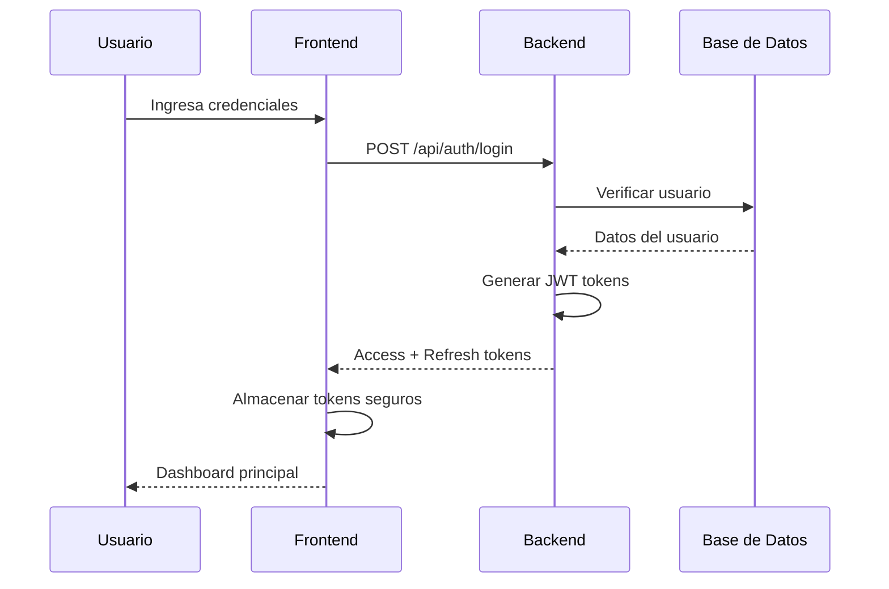
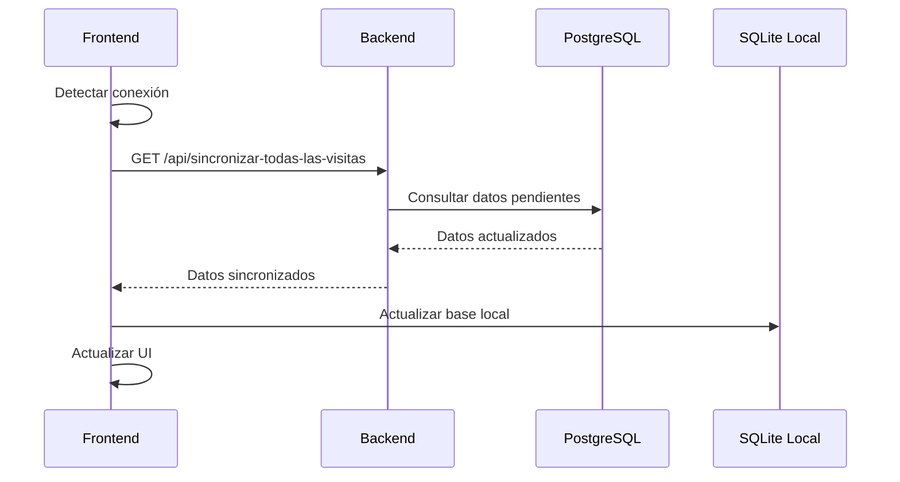
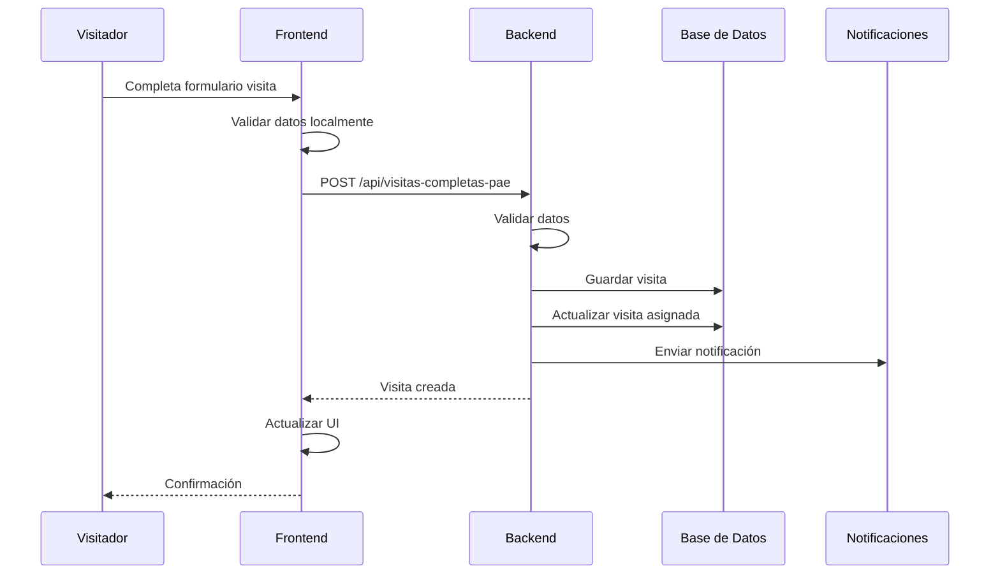

# 🔬 Documentación Técnica Completa - Sistema PAE Cauca

## 📋 Índice

1. [Arquitectura del Sistema](#arquitectura-del-sistema)
2. [Tecnologías Utilizadas](#tecnologías-utilizadas)
3. [Patrones de Diseño](#patrones-de-diseño)
4. [Flujo de Datos](#flujo-de-datos)
5. [Seguridad](#seguridad)
6. [Performance](#performance)
7. [Escalabilidad](#escalabilidad)
8. [Monitoreo](#monitoreo)
9. [Testing](#testing)
10. [Mantenimiento](#mantenimiento)

---

## 🏗️ Arquitectura del Sistema

### **Arquitectura General**

El Sistema PAE Cauca implementa una arquitectura de **microservicios distribuidos** con los siguientes componentes:

```
┌─────────────────┐    ┌─────────────────┐    ┌─────────────────┐
│   Frontend      │    │   Backend API   │    │   Base de       │
│   (Flutter)     │◄──►│   (FastAPI)     │◄──►│   Datos         │
│                 │    │                 │    │   (PostgreSQL)  │
└─────────────────┘    └─────────────────┘    └─────────────────┘
         │                       │                       │
         │                       │                       │
         ▼                       ▼                       ▼
┌─────────────────┐    ┌─────────────────┐    ┌─────────────────┐
│   Almacenamiento│    │   Notificaciones│    │   Servicios     │
│   Local         │    │   Push (FCM)    │    │   Externos      │
│   (SQLite)      │    │                 │    │   (Email, etc.) │
└─────────────────┘    └─────────────────┘    └─────────────────┘
```

### **Patrón de Arquitectura: Offline-First**

El sistema implementa el patrón **Offline-First**, permitiendo:

- **Funcionamiento sin conexión**: La aplicación funciona completamente offline
- **Sincronización automática**: Cuando se detecta conexión, sincroniza automáticamente
- **Resolución de conflictos**: Maneja conflictos de datos de forma inteligente
- **Indicadores de estado**: Muestra claramente el estado de sincronización

### **Separación de Responsabilidades**

#### **Frontend (Flutter)**
- **Presentación**: Interfaz de usuario y experiencia
- **Lógica de negocio local**: Validaciones y reglas de negocio
- **Almacenamiento local**: Cache y datos offline
- **Sincronización**: Coordinación con el backend

#### **Backend (FastAPI)**
- **API REST**: Endpoints para todas las operaciones
- **Lógica de negocio**: Reglas de negocio centralizadas
- **Persistencia**: Gestión de datos en PostgreSQL
- **Integración**: Servicios externos (FCM, Email)

#### **Base de Datos (PostgreSQL)**
- **Persistencia**: Almacenamiento de datos principales
- **Integridad**: Constraints y validaciones
- **Performance**: Índices y optimizaciones
- **Backup**: Estrategias de respaldo

---

## 🛠️ Tecnologías Utilizadas

### **Frontend - Flutter**

#### **Framework Principal**
- **Flutter 3.8.1+**: Framework multiplataforma
- **Dart 3.8.1+**: Lenguaje de programación

#### **Dependencias Principales**
```yaml
# HTTP y API
http: ^1.5.0                    # Cliente HTTP
jwt_decoder: ^2.0.1             # Decodificación JWT

# Almacenamiento
shared_preferences: ^2.2.2      # Preferencias locales
flutter_secure_storage: ^9.0.0  # Almacenamiento seguro
sqflite: ^2.3.0                 # Base de datos local SQLite

# UI y UX
provider: ^6.1.1                # Gestión de estado
table_calendar: ^3.0.9          # Calendario
fl_chart: ^0.68.0               # Gráficos

# Multimedia
image_picker: ^1.0.4            # Captura de imágenes
signature: ^5.4.0               # Captura de firmas
file_picker: ^10.3.1            # Selección de archivos

# Ubicación y Conectividad
geolocator: ^10.1.0             # GPS
connectivity_plus: ^6.1.4       # Estado de conexión

# Notificaciones
firebase_core: ^4.0.0           # Firebase core
firebase_messaging: ^16.0.0     # Notificaciones push
flutter_local_notifications: ^19.4.0  # Notificaciones locales

# Utilidades
intl: ^0.19.0                   # Internacionalización
path_provider: ^2.1.1           # Rutas de archivos
url_launcher: ^6.3.1            # Lanzamiento de URLs
permission_handler: ^11.1.0     # Gestión de permisos
```

#### **Arquitectura de Estado**
- **Provider Pattern**: Gestión de estado reactiva
- **ChangeNotifier**: Notificaciones de cambios
- **Consumer**: Consumo de estado en widgets

### **Backend - FastAPI**

#### **Framework Principal**
- **FastAPI 0.104.1**: Framework web moderno
- **Python 3.8+**: Lenguaje de programación
- **Uvicorn**: Servidor ASGI

#### **Dependencias Principales**
```txt
# Framework web
fastapi==0.104.1
uvicorn[standard]==0.24.0

# Base de datos
sqlalchemy==2.0.23
psycopg2-binary==2.9.9

# Autenticación y seguridad
python-jose[cryptography]==3.3.0
passlib[bcrypt]==1.7.4

# Procesamiento de datos
pandas==2.1.4
openpyxl==3.1.2

# Utilidades
python-multipart==0.0.6
```

#### **Patrones de Diseño**
- **Repository Pattern**: Abstracción de acceso a datos
- **Dependency Injection**: Inyección de dependencias
- **Factory Pattern**: Creación de objetos
- **Observer Pattern**: Notificaciones y eventos

### **Base de Datos - PostgreSQL**

#### **Configuración Optimizada**
```sql
-- Configuraciones de performance
max_connections = 200
shared_buffers = 256MB
effective_cache_size = 1GB
maintenance_work_mem = 64MB
checkpoint_completion_target = 0.9
wal_buffers = 16MB
default_statistics_target = 100
```

#### **Índices Optimizados**
```sql
-- Índices para consultas frecuentes
CREATE INDEX idx_visitas_profesional_fecha ON visitas_completas_pae(profesional_id, fecha_visita);
CREATE INDEX idx_visitas_estado ON visitas_completas_pae(estado);
CREATE INDEX idx_visitas_asignadas_visitador ON visitas_asignadas(visitador_id, estado);
CREATE INDEX idx_notificaciones_usuario ON notificaciones(usuario_id, leida);
```

---

## 🎨 Patrones de Diseño

### **Frontend - Patrones Flutter**

#### **1. Provider Pattern**
```dart
class ThemeProvider extends ChangeNotifier {
  ThemeMode _themeMode = ThemeMode.system;
  
  ThemeMode get themeMode => _themeMode;
  
  void toggleTheme() {
    _themeMode = _themeMode == ThemeMode.dark 
        ? ThemeMode.light 
        : ThemeMode.dark;
    notifyListeners();
  }
}
```

#### **2. Repository Pattern**
```dart
class ApiService {
  Future<List<Visita>> getVisitas() async {
    // Implementación de acceso a datos
  }
  
  Future<Visita> createVisita(Visita visita) async {
    // Implementación de creación
  }
}
```

#### **3. Factory Pattern**
```dart
class WidgetFactory {
  static Widget createButton({
    required String text,
    required VoidCallback onPressed,
    ButtonType type = ButtonType.primary,
  }) {
    switch (type) {
      case ButtonType.primary:
        return PrimaryButton(text: text, onPressed: onPressed);
      case ButtonType.secondary:
        return SecondaryButton(text: text, onPressed: onPressed);
    }
  }
}
```

### **Backend - Patrones Python**

#### **1. Dependency Injection**
```python
def get_current_user(
    credentials: HTTPAuthorizationCredentials = Depends(bearer_scheme),
    db: Session = Depends(get_db)
) -> models.Usuario:
    return _obtener_usuario_por_token(credentials.credentials, db)
```

#### **2. Repository Pattern**
```python
class VisitaRepository:
    def __init__(self, db: Session):
        self.db = db
    
    def create(self, visita_data: schemas.VisitaCreate) -> models.Visita:
        # Implementación de creación
        pass
    
    def get_by_id(self, visita_id: int) -> Optional[models.Visita]:
        # Implementación de búsqueda
        pass
```

#### **3. Observer Pattern**
```python
class NotificationService:
    def __init__(self):
        self.observers = []
    
    def add_observer(self, observer):
        self.observers.append(observer)
    
    def notify(self, event):
        for observer in self.observers:
            observer.update(event)
```

---

## 🔄 Flujo de Datos

### **1. Flujo de Autenticación**



### **2. Flujo de Sincronización**



### **3. Flujo de Creación de Visita**



---

## 🛡️ Seguridad

### **Autenticación y Autorización**

#### **JWT Tokens**
```python
# Configuración JWT
SECRET_KEY = "clave_secreta_muy_segura"
ALGORITHM = "HS256"
ACCESS_TOKEN_EXPIRE_MINUTES = 15
REFRESH_TOKEN_EXPIRE_DAYS = 7

# Estructura del token
{
  "sub": "usuario@email.com",
  "rol": "visitador",
  "id": 1,
  "type": "access",
  "exp": 1640995200
}
```

#### **Rate Limiting**
```python
# Configuración de rate limiting
@router.post("/login")
@limiter.limit("5/minute")
def login(form_data: schemas.Login):
    # Implementación
```

#### **Validación de Datos**
```python
# Schemas Pydantic para validación
class VisitaCreate(BaseModel):
    fecha_visita: datetime
    contrato: str
    operador: str
    caso_atencion_prioritaria: str
    municipio_id: int
    institucion_id: int
    sede_id: int
    profesional_id: int
    observaciones: Optional[str] = None
    respuestas_checklist: List[VisitaRespuestaCreate] = []
```

### **Almacenamiento Seguro**

#### **Frontend - Flutter Secure Storage**
```dart
// Configuración de almacenamiento seguro
static const _storage = FlutterSecureStorage(
  aOptions: AndroidOptions(
    encryptedSharedPreferences: true,
  ),
  iOptions: IOSOptions(
    accessibility: KeychainAccessibility.first_unlock_this_device,
  ),
);
```

#### **Backend - Cifrado de Contraseñas**
```python
# Bcrypt para hash de contraseñas
pwd_context = CryptContext(schemes=["bcrypt"], deprecated="auto")

def hash_password(password: str) -> str:
    return pwd_context.hash(password)

def verify_password(plain_password: str, hashed_password: str) -> bool:
    return pwd_context.verify(plain_password, hashed_password)
```

### **CORS y Headers de Seguridad**

```python
# Configuración CORS
app.add_middleware(
    CORSMiddleware,
    allow_origins=allowed_origins,
    allow_credentials=True,
    allow_methods=["GET", "POST", "PUT", "DELETE"],
    allow_headers=["*"],
)
```

---

## ⚡ Performance

### **Optimizaciones Frontend**

#### **Lazy Loading**
```dart
// Carga perezosa de pantallas
class LazyScreen extends StatelessWidget {
  @override
  Widget build(BuildContext context) {
    return FutureBuilder(
      future: _loadData(),
      builder: (context, snapshot) {
        if (snapshot.connectionState == ConnectionState.waiting) {
          return LoadingWidget();
        }
        return DataWidget(snapshot.data);
      },
    );
  }
}
```

#### **Caching Inteligente**
```dart
// Cache de datos con TTL
class DataCache {
  static final Map<String, CacheItem> _cache = {};
  
  static T? get<T>(String key) {
    final item = _cache[key];
    if (item != null && !item.isExpired) {
      return item.data as T;
    }
    _cache.remove(key);
    return null;
  }
}
```

#### **Optimización de Imágenes**
```dart
// Compresión de imágenes
Future<File> compressImage(File imageFile) async {
  final compressedImage = await FlutterImageCompress.compressAndGetFile(
    imageFile.absolute.path,
    imageFile.absolute.path + '_compressed.jpg',
    quality: 85,
    minWidth: 1024,
    minHeight: 1024,
  );
  return File(compressedImage!.path);
}
```

### **Optimizaciones Backend**

#### **Conexiones de Base de Datos**
```python
# Pool de conexiones
engine = create_engine(
    DATABASE_URL,
    pool_size=20,
    max_overflow=30,
    pool_pre_ping=True,
    pool_recycle=3600
)
```

#### **Caching de Consultas**
```python
# Cache con Redis (opcional)
from functools import lru_cache

@lru_cache(maxsize=128)
def get_municipios():
    return db.query(models.Municipio).all()
```

#### **Paginación**
```python
# Paginación de resultados
def get_visitas_paginated(
    skip: int = 0,
    limit: int = 100,
    db: Session = Depends(get_db)
):
    return db.query(models.VisitaCompletaPAE)\
        .offset(skip)\
        .limit(limit)\
        .all()
```

### **Optimizaciones de Base de Datos**

#### **Índices Compuestos**
```sql
-- Índices para consultas complejas
CREATE INDEX idx_visitas_complejas 
ON visitas_completas_pae(profesional_id, estado, fecha_visita);

CREATE INDEX idx_visitas_asignadas_complejas 
ON visitas_asignadas(visitador_id, estado, fecha_programada);
```

#### **Particionado de Tablas**
```sql
-- Particionado por fecha (para tablas grandes)
CREATE TABLE visitas_completas_pae_2024 
PARTITION OF visitas_completas_pae 
FOR VALUES FROM ('2024-01-01') TO ('2025-01-01');
```

---

## 📈 Escalabilidad

### **Escalabilidad Horizontal**

#### **Load Balancing**
```nginx
# Configuración Nginx para load balancing
upstream backend {
    server 127.0.0.1:8000;
    server 127.0.0.1:8001;
    server 127.0.0.1:8002;
}

server {
    location / {
        proxy_pass http://backend;
    }
}
```

#### **Microservicios**
```python
# Separación en microservicios
# auth_service.py
# visita_service.py
# notification_service.py
# report_service.py
```

### **Escalabilidad Vertical**

#### **Optimización de Recursos**
```python
# Configuración Gunicorn para múltiples workers
gunicorn app.main:app \
    --workers 4 \
    --worker-class uvicorn.workers.UvicornWorker \
    --worker-connections 1000 \
    --max-requests 1000 \
    --max-requests-jitter 100
```

#### **Caching Distribuido**
```python
# Redis para cache distribuido
import redis

redis_client = redis.Redis(
    host='localhost',
    port=6379,
    db=0,
    decode_responses=True
)

def cache_data(key: str, data: dict, ttl: int = 3600):
    redis_client.setex(key, ttl, json.dumps(data))
```

---

## 📊 Monitoreo

### **Logging Estructurado**

#### **Frontend - Flutter**
```dart
// Sistema de logging
class Logger {
  static void info(String message) {
    if (kDebugMode) {
      print('ℹ️ INFO: $message');
    }
  }
  
  static void error(String message, [dynamic error]) {
    if (kDebugMode) {
      print('❌ ERROR: $message');
      if (error != null) print('Error: $error');
    }
  }
}
```

#### **Backend - Python**
```python
# Configuración de logging
import logging

logging.basicConfig(
    level=logging.INFO,
    format='%(asctime)s - %(name)s - %(levelname)s - %(message)s',
    handlers=[
        logging.FileHandler('/var/log/pae-cauca/app.log'),
        logging.StreamHandler()
    ]
)

logger = logging.getLogger(__name__)
```

### **Métricas de Performance**

#### **Métricas de Aplicación**
```python
# Middleware para métricas
@app.middleware("http")
async def metrics_middleware(request: Request, call_next):
    start_time = time.time()
    response = await call_next(request)
    process_time = time.time() - start_time
    
    # Log de métricas
    logger.info(f"Request {request.method} {request.url} - {response.status_code} - {process_time:.4f}s")
    
    return response
```

#### **Métricas de Base de Datos**
```sql
-- Consultas de monitoreo
SELECT 
    schemaname,
    tablename,
    attname,
    n_distinct,
    correlation
FROM pg_stats 
WHERE schemaname = 'public';

-- Estadísticas de conexiones
SELECT 
    state,
    count(*) as connections
FROM pg_stat_activity 
GROUP BY state;
```

### **Alertas Automáticas**

#### **Script de Monitoreo**
```bash
#!/bin/bash
# monitor.sh

# Verificar servicio
if ! systemctl is-active --quiet pae-cauca; then
    echo "ALERT: PAE Cauca service is down!" | mail -s "Service Alert" admin@example.com
    systemctl restart pae-cauca
fi

# Verificar uso de memoria
MEMORY_USAGE=$(free | grep Mem | awk '{printf "%.2f", $3/$2 * 100.0}')
if (( $(echo "$MEMORY_USAGE > 90" | bc -l) )); then
    echo "ALERT: High memory usage: ${MEMORY_USAGE}%" | mail -s "Memory Alert" admin@example.com
fi

# Verificar espacio en disco
DISK_USAGE=$(df / | tail -1 | awk '{print $5}' | sed 's/%//')
if [ $DISK_USAGE -gt 90 ]; then
    echo "ALERT: High disk usage: ${DISK_USAGE}%" | mail -s "Disk Alert" admin@example.com
fi
```

---

## 🧪 Testing

### **Testing Frontend - Flutter**

#### **Unit Tests**
```dart
// test/models/usuario_test.dart
import 'package:flutter_test/flutter_test.dart';
import 'package:frontend_visitas/models/usuario.dart';

void main() {
  group('Usuario Model Tests', () {
    test('should create usuario from JSON', () {
      final json = {
        'id': 1,
        'nombre': 'Juan Pérez',
        'correo': 'juan@example.com',
        'rol': {'id': 1, 'nombre': 'visitador'}
      };
      
      final usuario = Usuario.fromJson(json);
      
      expect(usuario.id, 1);
      expect(usuario.nombre, 'Juan Pérez');
      expect(usuario.correo, 'juan@example.com');
    });
  });
}
```

#### **Widget Tests**
```dart
// test/widgets/login_screen_test.dart
import 'package:flutter/material.dart';
import 'package:flutter_test/flutter_test.dart';
import 'package:frontend_visitas/screens/login_screen.dart';

void main() {
  testWidgets('Login screen should have email and password fields', (WidgetTester tester) async {
    await tester.pumpWidget(MaterialApp(home: LoginScreen()));
    
    expect(find.byType(TextFormField), findsNWidgets(2));
    expect(find.text('Correo electrónico'), findsOneWidget);
    expect(find.text('Contraseña'), findsOneWidget);
  });
}
```

### **Testing Backend - Python**

#### **Unit Tests**
```python
# test_auth.py
import pytest
from fastapi.testclient import TestClient
from app.main import app

client = TestClient(app)

def test_login_success():
    response = client.post("/api/auth/login", json={
        "correo": "test@example.com",
        "contrasena": "password123"
    })
    assert response.status_code == 200
    assert "access_token" in response.json()

def test_login_invalid_credentials():
    response = client.post("/api/auth/login", json={
        "correo": "test@example.com",
        "contrasena": "wrongpassword"
    })
    assert response.status_code == 401
```

#### **Integration Tests**
```python
# test_integration.py
def test_create_visita_completa():
    # Login
    login_response = client.post("/api/auth/login", json={
        "correo": "visitador@example.com",
        "contrasena": "password123"
    })
    token = login_response.json()["access_token"]
    
    # Create visita
    headers = {"Authorization": f"Bearer {token}"}
    visita_data = {
        "fecha_visita": "2024-01-15T10:00:00",
        "contrato": "TEST-001",
        "operador": "TEST-OP",
        "caso_atencion_prioritaria": "SI",
        "municipio_id": 1,
        "institucion_id": 1,
        "sede_id": 1,
        "profesional_id": 1,
        "respuestas_checklist": []
    }
    
    response = client.post("/api/visitas-completas-pae", 
                          json=visita_data, 
                          headers=headers)
    assert response.status_code == 201
```

---

## 🔧 Mantenimiento

### **Rutinas de Mantenimiento**

#### **Limpieza de Logs**
```bash
#!/bin/bash
# cleanup_logs.sh

# Limpiar logs antiguos
find /var/log/pae-cauca -name "*.log" -mtime +30 -delete

# Comprimir logs
find /var/log/pae-cauca -name "*.log" -mtime +7 -exec gzip {} \;

echo "Log cleanup completed"
```

#### **Optimización de Base de Datos**
```sql
-- Script de optimización semanal
-- Vacuum y analyze
VACUUM ANALYZE;

-- Reindex
REINDEX DATABASE pae_cauca;

-- Actualizar estadísticas
ANALYZE;
```

#### **Backup Automático**
```bash
#!/bin/bash
# backup_daily.sh

DATE=$(date +%Y%m%d_%H%M%S)
BACKUP_DIR="/opt/pae-cauca/backups"

# Backup de base de datos
pg_dump -h localhost -U pae_user -d pae_cauca | gzip > $BACKUP_DIR/pae_cauca_$DATE.sql.gz

# Backup de archivos multimedia
tar -czf $BACKUP_DIR/media_$DATE.tar.gz /opt/pae-cauca/media/

# Limpiar backups antiguos
find $BACKUP_DIR -name "*.sql.gz" -mtime +30 -delete
find $BACKUP_DIR -name "*.tar.gz" -mtime +30 -delete

echo "Backup completed: $DATE"
```

### **Actualizaciones**

#### **Estrategia de Actualización**
1. **Backup completo** antes de actualizar
2. **Testing en ambiente de staging**
3. **Actualización gradual** por componentes
4. **Rollback plan** preparado
5. **Monitoreo intensivo** post-actualización

#### **Script de Actualización**
```bash
#!/bin/bash
# update_system.sh

echo "Starting system update..."

# Backup
./backup_daily.sh

# Update backend
cd /opt/pae-cauca
source venv/bin/activate
pip install -r requirements.txt --upgrade

# Update frontend
cd frontend_visitas
flutter pub get
flutter build apk --release

# Restart services
systemctl restart pae-cauca

echo "System update completed"
```

---

## 📋 Checklist de Mantenimiento

### **Diario**
- [ ] Verificar estado de servicios
- [ ] Revisar logs de errores
- [ ] Verificar espacio en disco
- [ ] Monitorear uso de memoria

### **Semanal**
- [ ] Backup completo del sistema
- [ ] Limpieza de logs antiguos
- [ ] Optimización de base de datos
- [ ] Revisión de métricas de performance

### **Mensual**
- [ ] Actualización de dependencias
- [ ] Revisión de seguridad
- [ ] Análisis de logs de acceso
- [ ] Pruebas de recuperación de backup

### **Trimestral**
- [ ] Auditoría de seguridad completa
- [ ] Revisión de arquitectura
- [ ] Planificación de escalabilidad
- [ ] Actualización de documentación

---

Esta documentación técnica completa proporciona una base sólida para el mantenimiento, escalabilidad y evolución del Sistema PAE Cauca. Cada aspecto está detallado con ejemplos prácticos y mejores prácticas de la industria.
